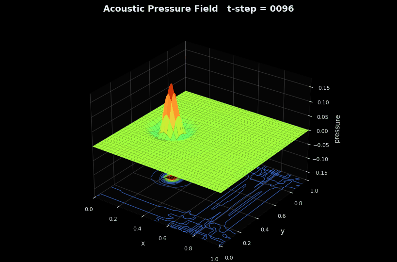
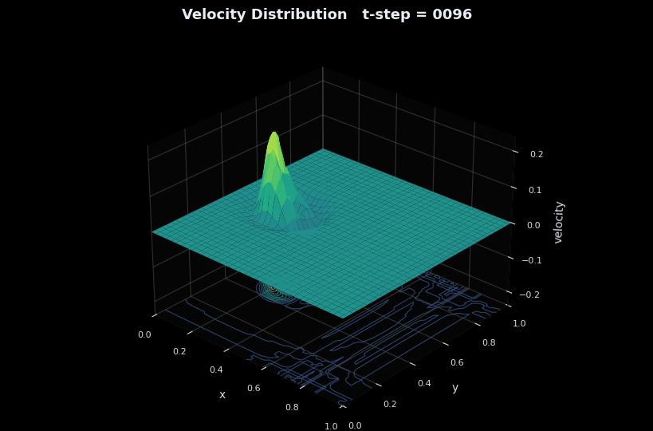
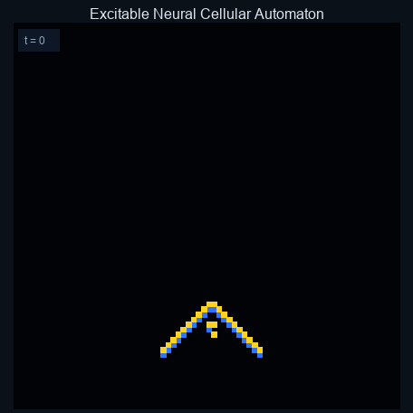
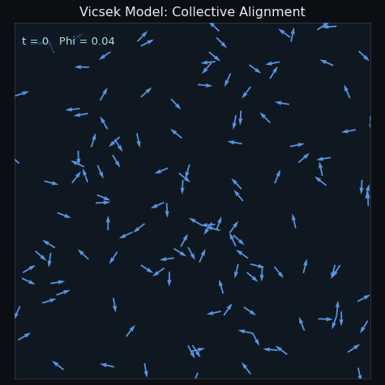

<!-- GitHub profile README for emanuelepsilon -->

# Emanuel Melki


M.Sc. Engineering Physics student at Uppsala University, specializing in artificial intelligence, machine learning systems, scientific computing and edge AI.

- Building numerical PDE simulations, edge AI systems, and model-backed multi-agent orchestration tools.
- Bachelor's thesis work on optimizing neural networks for constrained edge hardware.
- Practical experience with RAG, LLM APIs, MCP, AI model evaluation, Python tooling and data workflows.

## Numerical PDE Demo

| Acoustic pressure surface | Velocity distribution surface |
| --- | --- |
|  |  |

| Coupled map dynamics | Neural cellular automaton | Vicsek model alignment |
| --- | --- | --- |
|  |  |  |

## Current Work

**Acoustic Wave PDE Solver**  
[ENGINEERING-COMPUTING](https://github.com/emanuelepsilon/ENGINEERING-COMPUTING/tree/main/acoustic-wave-pde-solver) includes a 2D acoustic wave equation simulation with heterogeneous media, absorbing boundaries, receiver traces, and discrete energy diagnostics.

**Multi-Agent Orchestrator / Agent Army**  
[ORCHESTRATOR-WORKFLOW](https://github.com/emanuelepsilon/ORCHESTRATOR-WORKFLOW) implements a terminal-first manager/worker orchestration system for larger interdisciplinary AI projects. It supports Gemini, Ollama and OpenAI-compatible providers, spawns bounded role-specific workers, writes worker reports and synthesizes manager integration plans.

**Edge AI Optimization**  
Bachelor's thesis at Cicor Nordic Engineering AB focused on optimizing neural networks for constrained hardware while measuring tradeoffs between latency, memory, energy and accuracy.

## Featured Projects

| Repository | Focus |
| --- | --- |
| [AI-ML](https://github.com/emanuelepsilon/AI-ML) | Applied machine learning, LLM workflows, RAG, agents, TensorFlow/TFLite and edge AI experiments |
| [ORCHESTRATOR-WORKFLOW](https://github.com/emanuelepsilon/ORCHESTRATOR-WORKFLOW) | Model-backed manager/worker orchestration for AI-assisted project planning |
| [DATA-SQL](https://github.com/emanuelepsilon/DATA-SQL) | SQL practice, SQLite query tooling, structured data workflows and analytics exercises |
| [ENGINEERING-COMPUTING](https://github.com/emanuelepsilon/ENGINEERING-COMPUTING) | Scientific computing, C, MATLAB, numerical methods, embedded systems and simulations |
| [WEB-SOFTWARE](https://github.com/emanuelepsilon/WEB-SOFTWARE) | Web apps, API integrations, backend/frontend experiments and software tooling |

## Technical Stack

```text
Python | MATLAB | C | SQL | Bash | PowerShell
TensorFlow | scikit-learn | PyTorch | TFLite | NumPy | pandas | SciPy
LLM APIs | RAG | embeddings | agents | MCP | LlamaIndex | LangGraph | smolagents
SQLite | Git/GitHub | Linux | virtual environments | PlatformIO
```

## Certificates And Training

- Hugging Face Agents Course, Certificate of Excellence
- Hugging Face MCP Course: Fundamentals of Model Context Protocol
- Hugging Face MCP Course: Model Context Protocol for Production Automation

## Contact

[LinkedIn](https://linkedin.com/in/emanuel-melki-a657b02b0)  
[GitHub](https://github.com/emanuelepsilon)
