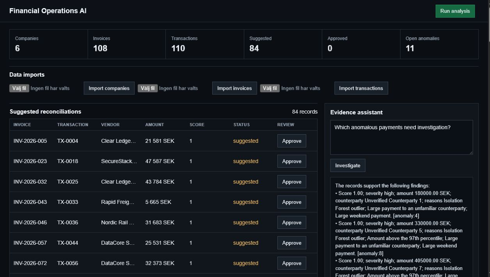
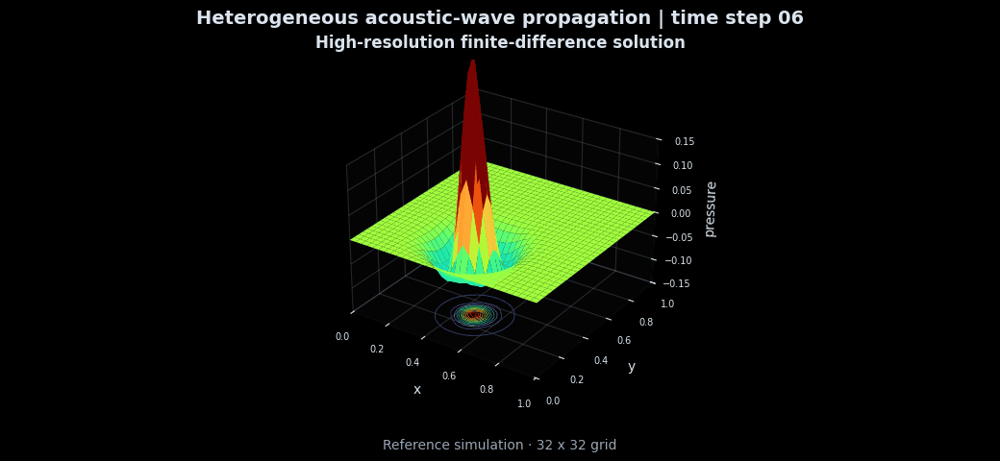
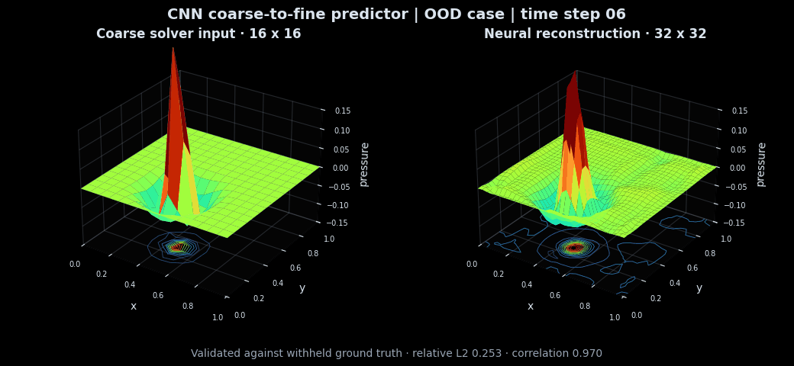
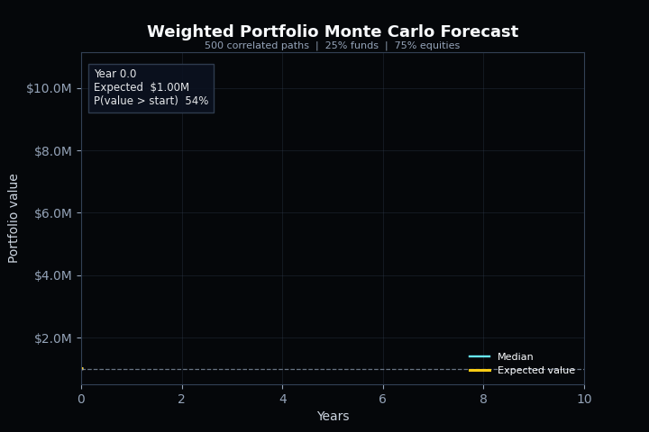

# Emanuel Melki


Engineering Physics student at Uppsala University. My work focuses on machine learning, LLM systems, scientific computing and edge AI.

## Current Work

### Financial Operations AI

[Financial Operations AI](https://github.com/emanuelepsilon/AI-ML/tree/main/financial-operations-ai) processes invoices and bank transactions for reconciliation and anomaly review. It combines trained models with deterministic checks, cited evidence and named human approval.



The included evaluation covers 108 invoices and 110 transactions. It reaches 1.000 invoice category accuracy, 1.000 reconciliation precision and 1.000 reconciliation recall on the synthetic benchmark.

### Agent Reliability Platform

[ORCHESTRATOR-WORKFLOW](https://github.com/emanuelepsilon/ORCHESTRATOR-WORKFLOW) uses a manager to divide larger projects between model backed workers. It supports Gemini, Ollama and OpenAI compatible providers. The reliability suite records decisions, latency and recovery paths. Its repeatable benchmark tests normal runs and controlled failures across offline and local model providers.

### Edge AI Optimization

My [bachelor's thesis study](https://lnkd.in/dJkYZ-tw) at Cicor Nordic Engineering AB examines neural networks on constrained hardware. It measures accuracy against latency, memory and energy use.

## Some of my work

| Finite-difference reference | Neural reconstruction |
| --- | --- |
|  |  |

## Recent Coursework

| Coupled map | Monte Carlo portfolio forecast | Vicsek model |
| --- | --- | --- |
|  |  |  |

## Repositories

| Repository | Contents |
| --- | --- |
| [AI-ML](https://github.com/emanuelepsilon/AI-ML) | Machine learning, LLM applications, RAG and edge AI |
| [ORCHESTRATOR-WORKFLOW](https://github.com/emanuelepsilon/ORCHESTRATOR-WORKFLOW) | Agent orchestration, structured traces and reliability evaluation |
| [DATA-SQL](https://github.com/emanuelepsilon/DATA-SQL) | SQL and data analysis exercises |
| [ENGINEERING-COMPUTING](https://github.com/emanuelepsilon/ENGINEERING-COMPUTING) | Numerical methods, simulations and embedded systems |
| [WEB-SOFTWARE](https://github.com/emanuelepsilon/WEB-SOFTWARE) | Web applications and API integrations |

## Technical Stack

```text
Python | MATLAB | C | SQL | Bash | PowerShell
TensorFlow | scikit-learn | PyTorch | TFLite | NumPy | pandas | SciPy
LLM APIs | RAG | embeddings | agents | MCP | LlamaIndex | LangGraph | smolagents
SQLite | Git | GitHub | Linux | virtual environments | PlatformIO
```

## Certificates

- Hugging Face Agents Course, Certificate of Excellence
- Hugging Face MCP Course: Fundamentals of Model Context Protocol
- Hugging Face MCP Course: Model Context Protocol for Production Automation

## Contact

[LinkedIn](https://www.linkedin.com/in/emanuel-melki)
